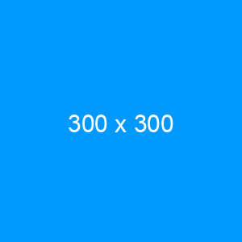

# Pendahuluan

Bab pendahuluan ini membahas mengenai latar belakang masalah, rumusan masalah, tujuan dan manfaat, ruang lingkup, serta sistematika penulisan yang akan digunakan dalam dokumen skripsi ini.

## Latar Belakang

Penulisan skripsi kerap kali dibebani dengan masalah format penulisan yang tidak sesuai. Menurut teman-teman kontributor github repository ini, masalah penulisan yang sepele namun merepotkan. Penelitian sejatinya adalah penulisan konten dan bukan tentang format konten. Peneliti bukanlah editor yang harus memperharikan estetika format penulisan.

Alat yang populer digunakan untuk skripsi adalah mesin pengolah kata. Mesin pengolah kata dapat terbilang flexible dan mudah untuk diubah. Alat ini populer disebut dengan istilah *what you see is what you get*. Namun, hal ini juga yang menjadi kelemahannya. Alat berikutnya yang popularitasnya berada dibawah mesin pengolah kata, adalah LaTeX. LaTeX memiliki kelebihan karena memiliki format file *plain text*. Format ini lebih fleksibel karena dapat dibuka di mayortias komputer. Namun, LaTeX memiliki *syntax* yang membutuhkan kurva pembelajaran yang tinggi.

Sayangnya, kedua opsi yang ditunjukan sebelumnya masih belum mengikuti aturan software engineering nomor 9, yaitu *separation of concerns leads to standard architectures* [@endres_handbook_2003]. Masih adanya tanggung jawab pengguna untuk mengatur format penulisan saat melakukan penulisan meningkatkan kompleksitas penggunaan.

*Separation of concerns* sudah diimplementasikan di pemograman web dengan memisahkan konten dalam bentuk file HTML dengan *styling*-nya dalam bentuk file css. Meskipun di dalam html dapat diberikan *styling*, hal ini bukanlah cara terbaik karena hukum *separation of concern* yang telah disebutkan sebelumnya. Namun, HTML memiliki banyak *noise* karena penggunaan tag pembuka dan penutupnya.

Markdown, di sisi lain, adalah format teks ringan yang digunakan untuk membuat dokumen yang mudah dibaca dan ditulis. Dalam penggunaannya, Markdown dapat dikombinasikan dengan alat-alat bantu seperti Git dan GitHub untuk memudahkan kolaborasi dan revisi skripsi. Dengan mengunggah skripsi dalam format Markdown ke dalam repositori GitHub, penulis skripsi dapat memperoleh manfaat dari kontrol versi, komentar, dan pemantauan perubahan.

Sayangnya markdown tidak memiliki kemampuan *styling* seperti halnya HTML. Untuk itu diperlukan konversi menjadi format lain yang dapat memberikan *styling*.

Untuk mengatasi permasalah tersebut, dibutuhkan cara untuk membuat proses penulisan skripsi menjadi lebih mudah dengan memisahkan atau mungkin tidak sama sekali mengatur format penulisan sehingga fokus dalam penulisan.

Dalam proses konversi markdown membutuhkan alat untuk mengkonversi format file yang akan digunakan untuk menulis menjadi file dengan format yang memiliki format penulisan yang sesuai.

Pandoc adalah salah satu alat yang dapat mengkonversi file dengan format markdown menjadi LaTeX yang kemudian dapat menciptkan file pdf. Namun, pandoc membutuhkan konfigurasi untuk mendapatkan format penulisan yang sesuai. Untuk itu tujuan dari penelitian ini adalah menciptkan alat yang dapat melakukan konversi untuk penulisan skripsi dalam format file markdown sehingga mendapatkan file dengan format pdf degan format penulisan yang sudah sesuai.

## Rumusan Masalah

Berdasarkan temuan dan penjelasan masalah yang dikemukakan di latar belakang, maka dilakukan penelitian untuk menciptkan alat yang dapat melakukan konversi penulisan skripsi dalam format file markdown menggunakan pandoc.

## Tujuan

Tujuan dari penelitian adalah menciptkan alat yang dapat melakukan konversi untuk penulisan skripsi dalam format file markdown sehingga mendapatkan file dengan format pdf degan format penulisan yang sudah sesuai.

## Manfaat Penelitian

Manfaat dalam penelitian ini adalah sebagai berikut.

1. Bagi institusi
  Mendapatkan satu format baku yang dapat menjadi sumber kebenaran.

2. Bagi Peneliti selanjutnya
  Penelitian ini dapat menjadi acuan untuk penelitian selanjutnya yang serupa.

## Ruang Lingkup

Ruang lingkup dalam penelitian ini adalah.

1. Menciptakan konfigurasi pandoc yang sesuai dengan format penulisan skripsi.
2. File yang dihasilkan adalah file pdf.

## Sistematika Penulisan

Sistematika penulisan yang digunakan dalam skripsi ini terbagi menjadi dalam
beberapa pokok bahasan.

Bab I adalah pendahuluan. Bab ini berisi latar belakang, rumusan masalah, tujuan, manfaat, ruang lingkup, dan sistematika penulisan dalam penyusunan skripsi.

Bab II adalah landasan teori. Bab ini berisi teori-teori yang menjadi acuan dan penjelasan alat-alat yang digunakan dalam penyusunan skripsi.

Bab III adalah metodologi penulisan. Bab ini berisi penjelasan metodologi yang akan digunakan dalam penyusunan skripsi.

Bab IV adalah hasil dan pembahasan. Bab ini berisi analisi kebutuhan, perencanaan alat yang akan dihasilkan, hasil implementasi pembuatan alat konversi dan penjelasan cara penggunnya.

Bab V adalah penutup. Bab ini berisi kesimpulan yang ditemukan pada skripsi dan saran yang untuk penelitian berikutnya.

# Landasan Teori

## Markdown

Markdown adalah format teks ringan yang dirancang untuk memudahkan penulis dalam membuat dokumen dengan cepat dan mudah dibaca. Dibuat oleh John Gruber pada tahun 2004, Markdown menggunakan sintaks sederhana dan intuitif yang dapat dengan mudah dikonversi ke dalam format HTML.

Menurut @gruber_daring_2004, Markdown dirancang untuk memungkinkan penulis untuk fokus pada konten tulisan, bukan pada format atau tata letak. Markdown juga memberikan fleksibilitas dalam menambahkan elemen seperti gambar, tautan, tabel, dan daftar dengan sintaks yang mudah dipahami.

## LaTeX

LaTeX merupakan bahasa markup dan sistem penyiapan dokumen yang populer di kalangan penulis ilmiah, terutama di bidang ilmu pengetahuan dan matematika [@lamport_latex_1994]. Dalam LaTeX, penulis dapat menulis isi dokumen tanpa khawatir tentang tampilannya, karena tampilan dokumen akan dihasilkan secara otomatis sesuai dengan aturan-aturan yang telah ditentukan sebelumnya. Dengan menggunakan LaTeX, penulis juga dapat dengan mudah menulis rumus matematika yang rumit dan notasi yang kompleks serta memformat dokumen dengan berbagai macam gaya dan tata letak yang berbeda melalui penggunaan paket dan kelas dokumen yang tersedia.

## YAML

YAML merupakan singkatan dari "YAML Ain't Markup Language", yaitu suatu format serialisasi data yang dirancang untuk memudahkan pembacaan dan penulisan oleh manusia. Format YAML biasanya digunakan untuk menyimpan dan membaca konfigurasi pada perangkat lunak, karena memungkinkan pengguna untuk mengorganisir data secara hierarkis dan mudah dibaca oleh manusia. Dalam skripsi ini, format YAML digunakan untuk mengatur konfigurasi dan parameter pada aplikasi yang dikembangkan [@ben-kiki_yaml_2021].

## Lua

Lua adalah bahasa pemrograman scripting yang ringan, cepat, dan dapat diperluas dengan mudah. Bahasa ini dikembangkan oleh PUC-Rio (Pontifical Catholic University of Rio de Janeiro) pada tahun 1993 dan sejak itu telah digunakan dalam berbagai aplikasi seperti game development, embedded systems, dan web development. Salah satu keunggulan Lua adalah kemampuannya untuk menawarkan kontrol yang sangat tinggi pada pemrogram saat mengeksekusi kode. Sebagai bahasa scripting, Lua memiliki sintaks yang mirip dengan bahasa Pascall dan C [@ierusalimschy_programming_2006].

## Pandoc

Pandoc adalah sebuah program yang digunakan untuk mengonversi dokumen dari satu format ke format lainnya. Program ini mendukung berbagai format dokumen, seperti HTML, LaTeX, Markdown, dan sebagainya [@macfarlane_pandoc_2011]. Pandoc juga mendukung berbagai fitur, seperti konversi dokumen ke PDF, DOCX, dan format lainnya, serta memungkinkan pengguna untuk menambahkan metadata ke dokumen. Program ini cukup fleksibel dan dapat digunakan dalam berbagai konteks, seperti penulisan akademik, publikasi, dan pengembangan perangkat lunak. Dalam penulisan akademik, Pandoc dapat digunakan untuk mengonversi dokumen dari satu format ke format lainnya, serta memungkinkan pengguna untuk menambahkan metadata, seperti judul, penulis, dan referensi [@macfarlane_pandoc_2011].

# Metodologi Penelitian

## Mollitia Magni

Lorem, ipsum dolor sit amet consectetur adipisicing elit. Culpa eveniet necessitatibus quis, praesentium pariatur recusandae placeat debitis. Deserunt, porro exercitationem, dignissimos ad maiores totam, non facere quas cumque dolore sequi. Distinctio nisi nobis reiciendis earum praesentium, magnam dicta repellendus obcaecati expedita quibusdam consequuntur asperiores voluptatum ratione facere pariatur dolorem, nihil delectus quas tempore, harum enim ipsam. Rem repellat, cum obcaecati similique ducimus quisquam nesciunt et nisi.

## Deserunt

Lorem ipsum dolor sit amet, consectetur adipisicing elit. Cum corrupti in beatae a error illo et aperiam, doloremque optio temporibus quas, earum similique eius, vel cumque accusantium! Veritatis praesentium a magni ab, deserunt fuga hic commodi error amet itaque, corrupti ullam! Voluptatem consequuntur beatae labore itaque similique velit, incidunt voluptatum enim voluptates doloremque modi corrupti, in exercitationem eius? Aliquid cupiditate saepe veniam quas vero iste nam sapiente aperiam quaerat, eum ex porro iure dolorum facere minima sed eos explicabo illum commodi animi harum distinctio sunt neque ipsam. Beatae obcaecati numquam iusto amet culpa exercitationem hic repellendus! Sed voluptates reprehenderit eligendi exercitationem esse quo assumenda molestiae similique doloremque rerum placeat, ratione autem cupiditate quia pariatur? Perspiciatis, eius sequi. Saepe possimus, error magni voluptatem deleniti unde explicabo repellat illo sapiente temporibus fugit dolorum exercitationem est.

# Hasil Dan Pembahasan

## Contoh Elemen

Berikut adalah contoh penggunaan elemen-elemen umum.

### Sub Judul

Lorem ipsum dolor sit amet consectetur, adipisicing elit. Ipsum repellat tenetur odio ea molestiae nemo expedita incidunt? Dignissimos laborum obcaecati veniam reiciendis quis nobis. Lorem, ipsum dolor sit amet consectetur adipisicing elit. Pariatur repellendus iure delectus facere totam error voluptas quae ratione illum. Odit minima quo maxime exercitationem totam vitae natus animi qui vero.

#### Hanya Diperbolehkan Sampai Dengan Empat Kedalaman

Lorem ipsum dolor sit amet consectetur adipisicing elit. Aliquam molestias nostrum harum commodi incidunt, distinctio totam. Iure dolor odio perspiciatis recusandae eos. Inventore in, debitis impedit non, dolore alias repellendus modi perferendis culpa nisi saepe exercitationem suscipit molestiae cumque iste.

#### Sub Sub Sub Sub Judul

Lorem ipsum dolor, sit amet consectetur adipisicing elit. Reprehenderit natus numquam alias in aperiam, sunt facere nam aspernatur eaque, quae odio labore dignissimos rerum quibusdam tenetur nisi quod porro culpa cupiditate deserunt iusto?

### Pemerian

Pemerian memiliki tiga tipe yang dapat digunakan. Tipe pertama adalah pemerian singkat. Berikut adalah contoh pemerian singkat.

1. Singkat
2. Padat
3. Jelas

Pemerian tipe kedua adalah pemerian yang memiliki poin-poin panjang. Pemerian tipe ini dapat dicontohkan sebagai berikut.

1. Pemerian yang memiliki poin yang panjang
2. Dua kata atau lebih yang mungkin cukup panjang

Pemerian tipe ketiga adalah pemerian yang dapat memiliki pemerian lagi di dalamnya. Pemerian tipe ini harus memiliki kepala pemerian lagi sebelum pemerian yang mengikutinya. Pemerian tipe ini dapat dicontohkan sebagai berikut.

1. Pemerian

   Text ini adalah penjelasan dari pemerian dengan penjelasan diikuti dengan pemerian. Fitur ini masih _buggy_ sehingga masih diperlukan _hack_ dengan menambahkan `\vspace{12pt}` setelah paragraf ini.
   \vspace{12pt} <!-- Tambahkan ini  -->

   a. Sit
   b. Amet

2. Tanpa Pemerian

   Hanya berisi penjelasan dari pemerian ini tanpa pemerian yang mengikutinya.

### Tabel

Tabel \ref{contohtabel} menunjukan hasil keluaran dari penggunaan tabel di markdown.

:::{.list-table widths=2,4,40 aligns=c,r,l}
   Contoh tabel \label{contohtabel}

   * - No
     - Nilai
     - Keterangan

   * - 1
     - 9.9
     - Lorem ipsum dolor sit, amet consectetur adipisicing elit. Sunt, earum minus, quos voluptates

   * - 2
     - 20
     - Lorem ipsum dolor sit amet consectetur, adipisicing elit. Aliquam accusantium possimus optio ex delectus, laudantium facilis suscipit, sed repellendus nisi nostrum in nesciunt consectetur quis consequatur magni, voluptas officiis voluptatibus!
:::

Tabel dapat berlanjut ke halaman berikutnya jika terlalu besar untuk ditampilakan di satu halaman. Contoh dari kasus ini dapat dilihat pada Tabel \ref{contohtabelpanjang}

:::{.list-table widths=1,10,10 aligns=c,l,l}
   Contoh Tabel Panjang \label{contohtabelpanjang}

   * - No
     - Aktor
     - Deskripsi

   * - 1
     - Lorem
     - Amet consectetur adipisicing elit

   * - 2
     - Lorem
     - Amet consectetur adipisicing elit

   * - 3
     - Lorem
     - Amet consectetur adipisicing elit

   * - 4
     - Lorem
     - Amet consectetur adipisicing elit

   * - 5
     - Lorem
     - Amet consectetur adipisicing elit

   * - 6
     - Lorem
     - Amet consectetur adipisicing elit

   * - 7
     - Lorem
     - Amet consectetur adipisicing elit

   * - 8
     - Lorem
     - Amet consectetur adipisicing elit

   * - 9
     - Lorem
     - Amet consectetur adipisicing elit

   * - 10
     - Lorem
     - Amet consectetur adipisicing elit

   * - 11
     - Lorem
     - Amet consectetur adipisicing elit

   * - 12
     - Lorem
     - Amet consectetur adipisicing elit

   * - 13
     - Lorem
     - Amet consectetur adipisicing elit

   * - 14
     - Lorem
     - Amet consectetur adipisicing elit

   * - 15
     - Lorem
     - Amet consectetur adipisicing elit

   * - 16
     - Lorem
     - Amet consectetur adipisicing elit

   * - 17
     - Lorem
     - Amet consectetur adipisicing elit

   * - 18
     - Lorem
     - Amet consectetur adipisicing elit

   * - 19
     - Lorem
     - Amet consectetur adipisicing elit

   * - 20
     - Lorem
     - Amet consectetur adipisicing elit

   * - 21
     - Lorem
     - Amet consectetur adipisicing elit

   * - 22
     - Lorem
     - Amet consectetur adipisicing elit

   * - 23
     - Lorem
     - Amet consectetur adipisicing elit

   * - 24
     - Lorem
     - Amet consectetur adipisicing elit

   * - 25
     - Lorem
     - Amet consectetur adipisicing elit

   * - 26
     - Lorem
     - Amet consectetur adipisicing elit

   * - 27
     - Lorem
     - Amet consectetur adipisicing elit

   * - 28
     - Lorem
     - Amet consectetur adipisicing elit

   * - 29
     - Lorem
     - Amet consectetur adipisicing elit

   * - 30
     - Lorem
     - Amet consectetur adipisicing elit

   * - 31
     - Lorem
     - Amet consectetur adipisicing elit

   * - 32
     - Lorem
     - Amet consectetur adipisicing elit

   * - 33
     - Lorem
     - Amet consectetur adipisicing elit

   * - 34
     - Lorem
     - Amet consectetur adipisicing elit

   * - 35
     - Lorem
     - Amet consectetur adipisicing elit

   * - 36
     - Lorem
     - Amet consectetur adipisicing elit

   * - 37
     - Lorem
     - Amet consectetur adipisicing elit

   * - 38
     - Lorem
     - Amet consectetur adipisicing elit

   * - 39
     - Lorem
     - Amet consectetur adipisicing elit

   * - 40
     - Lorem
     - Amet consectetur adipisicing elit

:::

### Gambar

Gambar \ref{contohgambar} merupkan contoh gambar yang dihasilkan menggunakan konfigurasi ini.



Selain itu, gambar juga dapat diatur tinggi dan lebarnya secara manual seperti yang ditunjukan pada Gambar \ref{contohgambarlebartinggi}.

{width=50% height=200px}

Hindari gambar yang terlalu besar, Gambar yang terlalu besar akan menyebabkan gambar keluar dari halaman dan merusak layout.

### Blok Kode

Blok kode belum diformat dan direferensi dengan baik

```js
import S from "sacntuary";
import { wasAYoungBoy } from "../utils/predicate";

S.when(wasAYoungBoy)(S.K("My father took me into the city"))(i);
// My father took me into the city
```

### Persamaan Matematika

Persamaan matematika belum diformat dan direferensi dengan baik. Persamaan matematika dalam garis $x = \frac{-b \pm \sqrt{b^2 - 4ac}}{2a}$. Atau dapat juga ditampilkan di garis baru.

$$
\int_{-\infty}^\infty e^{-x^2} dx = \sqrt{\pi}
$$

### Kutipan

Ini saya sedang mencoba melakukan kutipan di akhir kalimat [@smith_how_2018]. Menurut @smith_how_2018, ini adalah penulisan kutipan dengan sytle APA yang benar di awal kalimat.

## Ex ipsam

Lorem ipsum dolor sit amet consectetur adipisicing elit. Minima eveniet, fugit dicta asperiores ducimus placeat! Mollitia, blanditiis expedita placeat ab eum doloribus maiores laborum delectus ad dolore nam. Laborum, aspernatur.

# Penutup

## Kesimpulan

Lorem ipsum dolor sit amet consectetur adipisicing elit. Asperiores commodi quis temporibus excepturi nulla ea atque labore eaque at hic sequi obcaecati, dolorem natus nisi, fuga vero suscipit. Ex ipsam, fugiat corrupti veniam explicabo quam fuga ratione alias nulla animi eligendi, laudantium quaerat, unde ad voluptatibus quasi vel vitae reiciendis maxime iste similique. Corrupti at error maxime deleniti eaque, ad blanditiis explicabo a harum. Repellat consectetur quis, reiciendis sint vel repudiandae voluptas praesentium aut velit ab assumenda.

## Saran

Lorem ipsum dolor, sit amet consectetur adipisicing elit. Nulla dolores obcaecati cupiditate, alias dolor ratione corporis nemo odio itaque qui iusto tempore, optio dignissimos harum! Similique totam suscipit eius voluptatem iste inventore perspiciatis.
